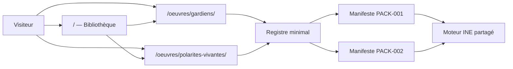
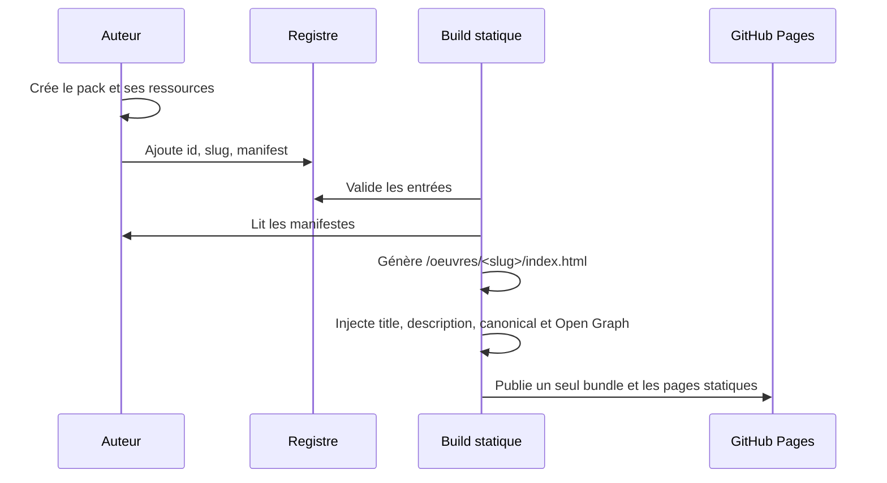

# Architecture de diffusion d’INE

Statut : décision d’architecture INE-008
Compatibilité cible : publication statique, GitHub Pages, aucun serveur applicatif

## Décision

Chaque œuvre possède une URL canonique lisible :

```text
/oeuvres/les-gardiens-des-recits-vivants/
/oeuvres/polarites-vivantes/
```

Ces URLs correspondent à de vrais dossiers contenant un `index.html`, générés pendant le build. Toutes les pages chargent exactement le même bundle INE. Le chemin sélectionne une entrée du registre, puis le moteur charge le manifeste associé.

La racine du site présente la bibliothèque. Le paramètre `?pack=<url-du-manifeste>` reste disponible pour la prévisualisation et le diagnostic, mais il n’est ni canonique ni destiné au référencement.



## Comparaison des options

| Critère | A — `/pack-001/` | B — `?pack=pack-001` | C retenue — `/oeuvres/<slug>/` généré |
|---|---|---|---|
| Simplicité initiale | bonne | excellente | bonne |
| GitHub Pages | exige de vrais `index.html` | native | native grâce à la génération |
| SEO | moyen si le nom reste technique | faible | excellent : URL, titre, description et canonical propres |
| Réseaux sociaux | métadonnées par œuvre difficiles | une seule page HTML | Open Graph généré par œuvre |
| Lisibilité | technique | technique | éditoriale et stable |
| Indépendance perçue | bonne | faible | excellente |
| Ajout d’un pack | page/config à créer | registre ou paramètre | une entrée de registre, route générée |
| Maintenance | risque de pages copiées | simple mais limité | bundle unique, pages produites automatiquement |
| Pérennité | correcte | faible comme URL publique | forte |

L’option A devient satisfaisante si elle est générée. L’option C en reprend donc le meilleur principe, mais sépare l’identifiant technique du slug public et ajoute les métadonnées statiques nécessaires au SEO et au partage.

## Registre des packs

`packs/index.json` reste nécessaire : un navigateur statique ne peut pas découvrir le contenu d’un dossier sur GitHub Pages. Une découverte automatique à l’exécution est donc impossible sans API ou serveur.

Le registre est volontairement minimal :

```json
{
  "format": "ine-pack-registry",
  "version": "1.0",
  "packs": [
    {
      "id": "pack-002",
      "slug": "polarites-vivantes",
      "manifest": "pack-002-polarites-vivantes/pack.json"
    }
  ]
}
```

Il ne répète ni titre, ni type, ni illustration, ni description. Ces informations appartiennent au manifeste. Le build et la bibliothèque vérifient que `entry.id` correspond à `manifest.id`. Les identifiants et slugs doivent être uniques.

Une recherche automatique des dossiers au build serait possible, mais ne fonctionnerait pas dans le navigateur et compliquerait le cas actuel où PACK-001 vit encore sous `examples/`. Le registre explicite est plus prévisible, portable et auditable. Si tous les packs sont un jour regroupés sous `packs/`, un script de génération du registre pourra être ajouté sans modifier le moteur ni le format public.

## Contrat de catalogue des manifestes

Tous les formats de pack publiables exposent les champs communs suivants :

```json
{
  "id": "pack-002",
  "title": "Polarités Vivantes",
  "subtitle": "Des tensions fécondes à habiter",
  "description": "Un parcours contemplatif…",
  "coverImage": "assets/images/00-couverture.webp",
  "coverImageAlt": "…"
}
```

Les données éditoriales ne sont présentes qu’une fois. La bibliothèque les lit depuis chaque manifeste. Le registre ne contient que les données de diffusion : route et emplacement du manifeste.

## Chaîne de publication



Pour publier une nouvelle œuvre :

1. créer son dossier, son manifeste et ses ressources ;
2. renseigner les cinq champs communs du catalogue ;
3. ajouter une entrée minimale dans `packs/index.json` ;
4. lancer les tests et le build ;
5. publier `dist/`.

Le moteur n’est pas modifié.

## Bibliothèque immersive

La page racine charge le registre, puis les manifestes en parallèle. Chaque carte utilise exclusivement :

- `coverImage` et `coverImageAlt` ;
- `title` et `subtitle` ;
- `description` ;
- le `slug` de diffusion pour le lien Explorer.

Le rendu utilise des éléments sémantiques (`section`, `article`, titres, liens), des textes alternatifs issus des manifestes, un focus visible et une grille responsive.

## URLs et métadonnées

- URL publique : `/oeuvres/<slug>/`
- URL de prévisualisation : `/?pack=<manifest>`
- fragments internes : réservés à la progression propre au renderer
- URL canonique : injectée au build
- Open Graph : titre, description, couverture et URL injectés au build
- bundle : unique pour toute la plateforme

Un changement de slug est une rupture d’URL. En hébergement statique sans redirection, l’ancien dossier doit être conservé avec une page de redirection explicite.

## Frontières architecturales

Le registre sait où trouver un pack, mais ne connaît pas son contenu. Le manifeste connaît l’œuvre, mais ne connaît ni les autres packs ni la bibliothèque. Le moteur connaît les formats qu’il sait interpréter, mais ne contient aucun titre, récit ou chemin propre à une œuvre.

Supprimer PACK-001 ne doit nécessiter que la suppression de son dossier et de son entrée de registre. Il en va de même pour PACK-002. Une entrée de registre pointant vers un manifeste absent fait volontairement échouer le build : une publication partiellement cassée n’est pas acceptée.

## Évolutions possibles

- générer `sitemap.xml`, `robots.txt` et un flux JSON public à partir du même registre ;
- ajouter `status`, `publishedAt` ou `order` au registre uniquement si ces données relèvent réellement de la diffusion ;
- produire des images sociales dédiées via un champ manifeste optionnel ;
- utiliser un domaine personnalisé sans changer la structure des URLs ;
- ajouter un cache hors ligne versionné par build ;
- extraire le validateur de registre dans un paquet partagé si plusieurs applications consomment le catalogue.

Une base de données, un routeur côté serveur ou une dépendance de framework ne sont justifiés que si la plateforme acquiert des fonctions dynamiques telles que comptes, recherche distante ou publication sans build.
