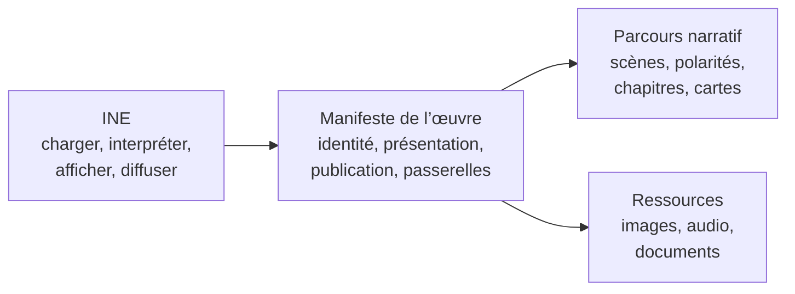
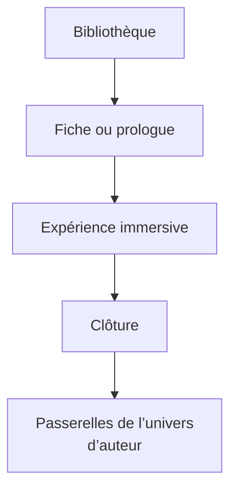

# Modèle éditorial des œuvres immersives

Statut : décision d’architecture éditoriale INE-009
Périmètre : univers numérique de Zéphyr Avenel

## Définition

Une œuvre immersive est une publication numérique autonome de Zéphyr Avenel, interprétée par INE et accessible par sa propre URL. Elle possède une identité, un parcours, des ressources et des passerelles éditoriales. Elle n’est ni une page du moteur, ni une simple collection de scènes.

Le modèle distingue trois responsabilités :



- **INE** reste générique. Il connaît des contrats de données, jamais les œuvres.
- **Le manifeste** décrit l’œuvre publiée et relie ses différentes dimensions.
- **Le parcours** contient uniquement la matière narrative et sa navigation interne.

## Décision de versionnement

Le manifeste actuel reste adapté. PACK-001 et PACK-002 partagent déjà le noyau nécessaire à la bibliothèque : `id`, `title`, `subtitle`, `description`, `coverImage` et `coverImageAlt`.

Il n’est pas justifié de créer immédiatement un format `2.0`. La cible est une évolution additive :

1. conserver les champs techniques existants propres à chaque format ;
2. stabiliser le noyau éditorial commun à la racine ;
3. ajouter, quand une œuvre en a besoin, un objet optionnel `editorial` ;
4. ne rendre un nouveau champ obligatoire qu’au moment de publier une nouvelle œuvre, pas rétroactivement.

Une future version majeure ne sera utile que si la structure du parcours change de manière incompatible.

## Noyau commun

Ces informations appartiennent directement à toute œuvre publiable :

| Champ | Rôle | Statut cible |
|---|---|---|
| `id` | identité technique stable | obligatoire |
| `title` | titre public | obligatoire |
| `subtitle` | promesse éditoriale courte | obligatoire pour la bibliothèque |
| `description` | résumé de carte, une à trois phrases | obligatoire pour la bibliothèque |
| `author` | attribution explicite : Zéphyr Avenel | recommandé |
| `version` | version du contenu publié | obligatoire |
| `language` | langue principale | obligatoire |
| `coverImage` | couverture de bibliothèque et fallback | obligatoire |
| `coverImageAlt` | alternative textuelle | obligatoire |

Le `slug` n’appartient pas à l’œuvre : il appartient au registre de diffusion. L’URL canonique est générée à partir du slug. Cette séparation permet de déplacer ou republier une œuvre sans modifier son contenu.

## Extension `editorial`

L’objet optionnel `editorial` regroupe les informations qui enrichissent la publication sans intervenir dans le rendu du parcours :

```json
{
  "editorial": {
    "presentation": {
      "longDescription": "Présentation développée de l’œuvre.",
      "shareImage": "assets/images/share.webp",
      "shareImageAlt": "Alternative textuelle",
      "estimatedDurationMinutes": 12
    },
    "publication": {
      "createdAt": "2026-07-30",
      "publishedAt": "2026-08-15",
      "updatedAt": "2026-08-15",
      "copyright": "© 2026 Zéphyr Avenel",
      "license": "Tous droits réservés"
    },
    "discovery": {
      "keywords": ["récit immersif", "mémoire"],
      "seoDescription": "Description destinée aux moteurs de recherche."
    },
    "connections": [],
    "resources": []
  }
}
```

Le contrat de référence est `schemas/editorial-metadata.schema.json`. Il est volontairement indépendant des formats narratif et contemplatif afin de pouvoir être référencé par leurs prochaines versions de schéma. Il s’agit à ce stade d’un contrat cible : les validateurs actuels ne doivent pas recevoir `editorial` avant cette intégration additive.

### Présentation

- `longDescription` sert à une future fiche d’œuvre ; elle ne remplace pas le résumé court.
- `shareImage` est distincte de la couverture seulement lorsqu’un cadrage social spécifique existe.
- `estimatedDurationMinutes` est une indication éditoriale, pas une limite du moteur.
- l’image finale reste un élément de parcours propre au format ; elle ne doit pas être déplacée dans les métadonnées communes.

### Publication

Les dates utilisent `YYYY-MM-DD`. `createdAt` décrit la création de l’œuvre, `publishedAt` sa première mise en ligne et `updatedAt` sa dernière modification éditoriale significative.

Le copyright et la licence doivent rester explicites dans chaque manifeste : l’univers est mono-auteur, mais les œuvres peuvent avoir des conditions de diffusion différentes.

### Référencement

`description` reste le résumé humain de la bibliothèque. `seoDescription` n’est utile que lorsqu’une formulation spécifique est nécessaire. À défaut, le build réutilise `description`.

Le titre Open Graph vient de `title`, sa description de `seoDescription` ou `description`, et son image de `shareImage` ou `coverImage`. L’URL canonique vient toujours du registre.

## Passerelles dans l’univers d’auteur

Une liste générique `connections` est préférable à cinq tableaux (`relatedBooks`, `relatedArticles`, etc.). Elle conserve un seul contrat et permet d’ordonner librement les passerelles :

```json
{
  "kind": "book",
  "title": "Titre du livre",
  "url": "https://...",
  "relationship": "prolongement",
  "description": "Cette œuvre approfondit le même motif."
}
```

Types prévus :

- `book` : ouvrage publié ;
- `article` : article du blog ;
- `immersive-work` : autre œuvre INE ;
- `eria` : ressource ou expérience ERIA ;
- `author-site` : page du site auteur.

Une œuvre INE interne utilise de préférence `targetWorkId`. Le registre résout alors son URL. Un lien externe utilise `url`. Le manifeste ne dépend jamais du slug d’une autre œuvre.

La relation doit être éditoriale, pas seulement technique : `source`, `prolongement`, `écho`, `origine`, `approfondissement`. Le visiteur comprend ainsi pourquoi le lien lui est proposé.

## Ressources complémentaires

`resources` référence uniquement des éléments proposés au lecteur : carnet PDF, téléchargement, audio complémentaire ou vidéo. Les images nécessaires au parcours restent déclarées dans le parcours ou le manifeste de format.

Cette distinction évite de transformer le manifeste en inventaire de fichiers.

## Bibliothèque de l’univers

La bibliothèque évolue par niveaux, sans surcharger les cartes :

1. **Carte** : couverture, titre, sous-titre, résumé et durée.
2. **Fiche d’œuvre éventuelle** : présentation longue, publication et ressources.
3. **Après l’expérience** : passerelles vers livres, articles, ERIA et œuvres proches.

Les passerelles ne doivent pas interrompre le rythme immersif. Elles sont présentées avant l’entrée ou après la clôture, jamais au milieu d’une scène sauf décision narrative explicite.



## Champs à ne pas ajouter

Dans un univers mono-auteur, les éléments suivants introduiraient une complexité inutile :

- comptes auteur, rôles et permissions ;
- collections multi-tenant ;
- moteur de taxonomie universel ;
- workflow éditorial distant ;
- base de données pour des métadonnées statiques ;
- URL canonique écrite à la main dans chaque pack ;
- listes séparées par type de relation.

## Compatibilité

PACK-001 et PACK-002 restent valides sans `editorial`. La bibliothèque actuelle continue d’utiliser le noyau commun. GitHub Pages ne requiert aucune logique serveur. Le moteur ne doit lire l’extension que lorsqu’une fonction d’interface en a besoin.

La migration recommandée est progressive :

- aucune migration obligatoire pour les deux œuvres existantes ;
- adoption du noyau complet pour PACK-003 ;
- ajout facultatif des métadonnées historiques aux anciens packs ;
- intégration du schéma dans les validateurs de format seulement quand la bibliothèque affiche réellement ces données.

## Bonnes pratiques

- écrire les métadonnées depuis le point de vue du lecteur ;
- conserver `id` et slug stables après publication ;
- éviter toute répétition entre registre et manifeste ;
- utiliser des chemins relatifs pour les ressources du pack ;
- fournir une alternative textuelle utile à chaque image ;
- renseigner uniquement des passerelles éditorialement justifiées ;
- vérifier régulièrement les liens externes ;
- mettre à jour `updatedAt` pour un changement éditorial, pas pour une simple reconstruction technique.
